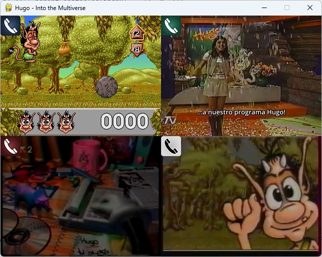

# Hugo - Into the multiverse

Relive the Hugo TV gaming experience from the 90s!

Multiplayer reimplementation of Hugo minigames using the original resources.

- [Game code (uses pygame, should be cross-platform)](game/)
- [Game asset converter](converter/)

If you want to play with actual phones (or IP phones):
- [PJSUA tool (converts SIP tones to keys)](pjsua-to-keys/)
- [Asterisk config](asterisk-config/)

### Other resources
- [Project phases, improvements and future ideas](docs/phases.md)
- [Reverse engineered format documentation](docs/reverse.md)

### Contribution
I'm looking for contributors! If you are interested in:
- AI/LLM and speech recognition
- Reimplementing old DOS/WIN32 games

...you can join the team and help the project advance!

**Disclaimer: Obviously, this project is not official and is unrelated to ITE/Pramer/Promofilm/Magic Kids. Please support the official Hugo franchise by buying their newest games and merch**

Video sources:
- AR: https://www.youtube.com/watch?v=GcaXt0ncV6w
- CL: https://www.youtube.com/watch?v=3lYDhtvSFGM
- DN: https://youtu.be/hBzQVuTNmB4?t=271
- DE: https://www.youtube.com/watch?v=4upvPi4p5gA
- FR: https://www.youtube.com/watch?v=Y7EpznT57lI
- PT: https://www.youtube.com/watch?v=f67oNqGmAhE
- PT-br: https://www.youtube.com/watch?v=0RLN_KilOro

Similar projects:
- https://github.com/tuomasth/Hugo_Ski_Game_Finnish_24-2-2023
- https://github.com/supinrus/HugoMega
- https://github.com/supinrus/HugoResourceViewer
- https://github.com/erengaygusuz/hugo-lululu
- https://github.com/ElMiauro/KitoPizzas

### By gzalo (Gonzalo Avila) 2023-20XX
### In memoriam - Hugo Avila - 1921-2007
