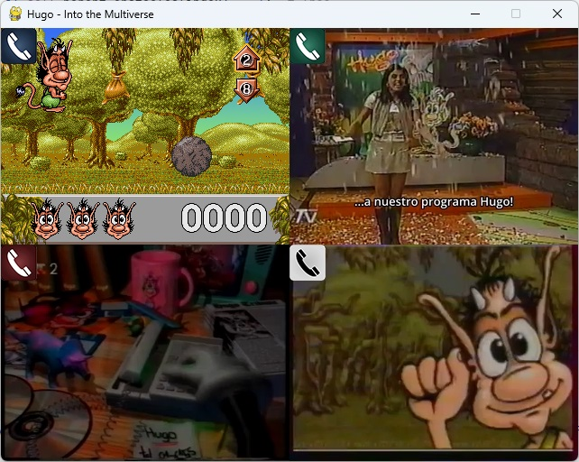

# Hugo - Into the multiverse

Relive the Hugo TV gaming experience from the 90s!

Multiplayer reimplementation of Hugo minigames using the original resources.

- [Main game](game/)
- [Audio server](audio-server/)
- [Lite version (single-player, C) ideal for porting into smaller platforms](game-lite/)

If you want to play with actual phones/IP phones:
- [Hardware to convert phone keys into an USB keyboard](tools/phone-keys-usb/)
- [PJSUA tool - converts SIP tones to keys](tools/pjsua-to-keys/) + [Sample asterisk config](tools/asterisk-config/)

## Other things
- [Game asset converter](tools/converter/)
- [Project phases, improvements and future ideas](docs/phases.md)
- [Reverse engineered format documentation](docs/reverse.md)

## Contribution
I'm looking for contributors! If you are interested in:
- Reimplementing old Hugo minigames
- AI/LLM and speech recognition

...you can help the project advance!

**Disclaimer: Obviously, this project is not official and is unrelated to ITE/Pramer/Promofilm/Magic Kids. Please support the official Hugo franchise by buying their newest games and merch**

## Video sources
- AR: https://www.youtube.com/watch?v=GcaXt0ncV6w
- CL: https://www.youtube.com/watch?v=3lYDhtvSFGM
- DN: https://youtu.be/hBzQVuTNmB4?t=271
- DE: https://www.youtube.com/watch?v=4upvPi4p5gA
- FR: https://www.youtube.com/watch?v=Y7EpznT57lI
- PT: https://www.youtube.com/watch?v=f67oNqGmAhE
- PT-br: https://www.youtube.com/watch?v=0RLN_KilOro

## Special thanks
- AsuharaMoon for the recreation of the [scoreboard sprite sheets](https://www.deviantart.com/asuharamoon/art/Screentroll-Hugo-Scoreboard-Recreation-Sheets-1291639885#image-2)!
- [Nostalgikeren](https://www.youtube.com/@NostalgikerenDK/videos) uploaded many videos from the original TV show, which were very useful for reference!

## Similar projects
- https://github.com/tuomasth/Hugo_Ski_Game_English_Texts_13-10-2024
- https://github.com/supinrus/HugoMega
- https://github.com/supinrus/HugoResourceViewer
- https://github.com/supinrus/ite-hugo-utils
- https://github.com/erengaygusuz/hugo-lululu
- https://github.com/humbertodias/hugo-resource-viewer

### Related to Kito Pizzas 
- https://github.com/gzalo/kitopizzas
- https://github.com/ElMiauro/KitoPizzas

### By gzalo (Gonzalo Avila) 2023-20XX - In memoriam Hugo Avila - 1921-2007
