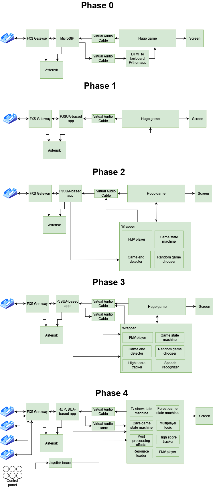

# Hugo-RE
Relive the Hugo TV gaming experience from the 90s!

Reimplementation of Hugo minigames using the original resources.

Using an IP phone (or an analog phone with a FXS gateway) you can play the Hugo games virtually.

**Phase 0**: As seen in Flashparty 2023, with quite a high latency due to the audio processing chain

**Phase 1**: As seen in Cybercirujas federal event 2023, way lower latency using pjsua, quite playable

**Phase 2**: As seen in Cybercirujas event June 2024, introduced a wrapper with full-motion videos and random game selector

**Phase 3**: As seen in Cybercirujas CCK July 2024, introduced a high score tracker, name recognizer and more

**Phase 4**: As seen in Punkware Cyberzine Aug 2024 and Cybercirujas federal event 2024, introduced 4 player mode using a reimplementation of the game

- [Game wrapper with full-motion videos](game/)
- [Game asset converter](converter/)
- [PJSUA (SIP tones to keys)](pjsua-to-keys/)
- [Asterisk config](asterisk-config/)
- [Reverse engineered format documentation](docs/reverse.md)
- [Hugo resource viewer and repacker (no longer used)](viewer/)
- [DTMF tones to key converter (no longer used)](dtmf-to-keys/)

I'm looking for contributors! If you are interested in:
- AI/LLM and speech recognition
- Reimplementing old DOS/WIN32 games

...you can join the team and help the project advance!

**Disclaimer: Obviously, this project is not official and is unrelated to ITE/Pramer/Promofilm/Magic Kids. Please support the official Hugo franchise by buying their newest games and merch**

Similar projects:
- https://github.com/tuomasth/Hugo_Ski_Game_Finnish_24-2-2023
- https://github.com/supinrus/HugoMega
- https://github.com/supinrus/HugoResourceViewer
- https://github.com/erengaygusuz/hugo-lululu
- https://github.com/ElMiauro/KitoPizzas

### By gzalo (Gonzalo Avila, project started late 2023)
### In memoriam - Hugo Avila - 1921-2007
