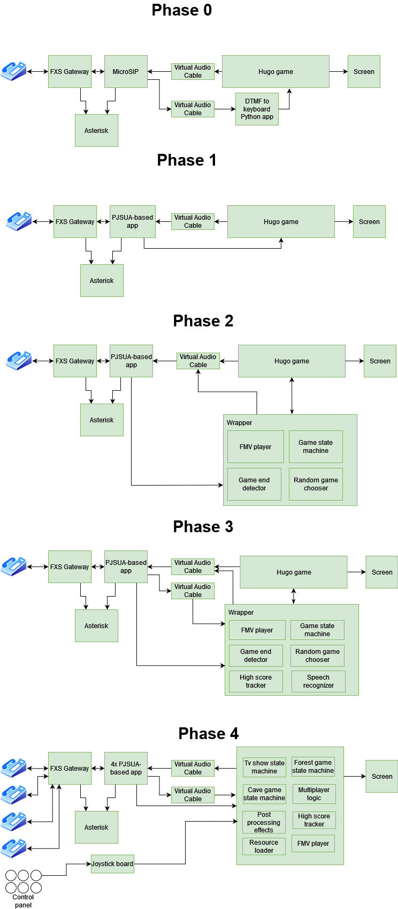

# Project phases

**Phase 0**: As seen in Flashparty 2023, with quite a high latency due to the audio processing chain

**Phase 1**: As seen in Cybercirujas federal event 2023, way lower latency using pjsua, quite playable

**Phase 2**: As seen in Cybercirujas event June 2024, introduced a wrapper with full-motion videos and random game selector

**Phase 3**: As seen in Cybercirujas CCK July 2024, introduced a high score tracker, name recognizer and more

**Phase 4**: As seen in Punkware Cyberzine Aug 2024 and Cybercirujas federal event 2024, introduced 4 player mode using a reimplementation of the game

